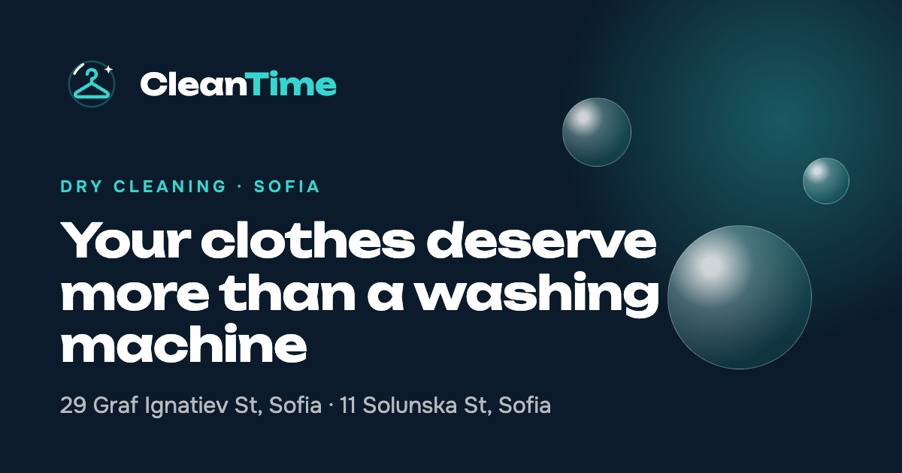

<p align="center">
  
</p>

<h1 align="center">CleanTime</h1>

<p align="center">
  The website of CleanTime, a dry cleaning and laundry business with two shops in central Sofia.<br>
  Three languages, 3D scenes, a chat assistant and everything Google needs.
</p>

<p align="center">
  <a href="https://cleantime-six.vercel.app"><b>🌐 See it live → cleantime-six.vercel.app</b></a>
</p>

<p align="center">
  
  
  
  
  
</p>

---

## What's inside

| | |
|---|---|
| 🌍 **Three languages** | Bulgarian, English and German, each on its own address (`/bg`, `/en`, `/de`). |
| 🫧 **3D bubbles** | Soap bubbles in the hero that float, move away from the mouse and pop into droplets when clicked or tapped. |
| 🌊 **Logo wash** | Clicking the logo washes the screen with a wave, returns to the top and pops every bubble. |
| 🧥 **3D logo** | The logo as a chrome 3D object at the end of the page; it turns with scrolling and spins when tapped. |
| 🃏 **Cards with depth** | Service cards tilt toward the mouse or under a finger, with a glare. |
| 💬 **Assistant** | A chat covering about 40 topics: services, stains, care labels, dyeing, shops. Understands all three languages. |
| 🏷️ **Care label guide** | What the professional cleaning symbols mean. |
| 🚚 **Home delivery** | The headline benefit: pickup and return at the customer's door, free on orders over €30. |
| ✉️ **Viber and email** | One tap to message the shop on Viber or send an email. |
| 📍 **Two shops** | Map, phone and directions for each. |
| 📱 **Phone first** | Full-screen menu, a "Call" bar, touch effects. |
| 🔎 **For Google** | Local business data, questions and answers, sitemap, share images. |

There are no prices and no online ordering on the site: that was agreed with the client. The main action everywhere is a phone call.

## Getting started

Requires Node.js 20 or newer.

```bash
npm install
npm run dev
```

The site starts at [http://localhost:3000](http://localhost:3000) and redirects to `/bg`.

| Command | What it does |
|---|---|
| `npm run dev` | Runs the site for development. |
| `npm run build` | Builds the production version. |
| `npm run start` | Serves the built version. |
| `npm run lint` | Checks the code. |

## Where things live

```
src/
├── app/
│   ├── [lang]/           the page and shared layout for each language
│   ├── globals.css       colours, animations, 3D tilt
│   ├── sitemap.ts        sitemap
│   ├── robots.ts         rules for search engines
│   └── manifest.ts       icon and name for a phone's home screen
├── components/
│   ├── three/            the 3D scenes: bubbles, the 3D logo and their shared base
│   ├── Scene3D.tsx       loads a 3D scene after first paint
│   ├── Assistant.tsx     the assistant chat
│   ├── Tilt.tsx          a card that tilts in 3D
│   ├── MobileMenu.tsx    the phone menu
│   ├── Effects.tsx       the progress bar and the reveal on scroll
│   ├── HomeLink.tsx      the logo link and its "wash" back to the top
│   └── Logo.tsx          the logo
├── lib/
│   ├── site.ts           shops, phone numbers, the site address
│   ├── i18n.ts           the list of languages
│   └── assistant.ts      which words lead to which answer
└── messages/
    ├── bg.json           every text in Bulgarian
    ├── en.json           … in English
    └── de.json           … in German
```

## How to change something

**Text.** Everything a visitor reads is in `src/messages/`. Make each change in all three files, under the same keys.

**Phone or address.** In `src/lib/site.ts`; how the address is written in each language is under `locations.items` in the three language files.

**A new assistant answer.** The text goes in `assistant.kb` in the three language files, and the words that trigger it go in `knowledge` in `src/lib/assistant.ts`. The assistant never makes anything up: it answers only with text from these files, and when it does not know, it shows the phone numbers.

**A new language.** A new file in `src/messages/`, registered in `src/lib/i18n.ts`, plus a share image in `public/og/`.

**Photos.** They live in `public/photos/`. The current ones are free stock photos (see credits below); replace a file with the same name to swap in a real photo of the shops.

**Viber and email.** In `src/lib/site.ts`.

## Deployment

Automatic: every change to `main` is deployed to Vercel and is live in about a minute. Every other branch gets its own preview address.

Two settings control how search engines see the site:

| Setting | What it is for |
|---|---|
| `NEXT_PUBLIC_SITE_URL` | The real address of the site, for example `https://cleantime.bg`. Without it the Vercel address is used. |
| `NEXT_PUBLIC_INDEXABLE` | Set to `true` to let Google index the site. Without it the site is hidden from search engines. |

## Before going live on the real domain

- [ ] Real photos of both shops in place of the stock photos
- [ ] Opening hours for both shops
- [ ] The client has read the texts, especially the German and English
- [ ] The domain points to Vercel
- [ ] `NEXT_PUBLIC_SITE_URL` and `NEXT_PUBLIC_INDEXABLE=true` are set

## Rules that keep the site fast

- Nothing starts invisible on first paint. The reveal on scroll switches on only after the page has loaded, and only for content below the screen.
- The 3D scenes load after the text and buttons, and pause while off screen.
- On phones there are fewer, lighter bubbles.
- When a device has animations turned off, the 3D scenes and motion do not run.

## The logo

"Hanger Home": the shoulders of a clothes hanger form the roof of a house, for the shop's headline promise of pickup and delivery at the door. The files are in `brand/`:

| File | Use |
|---|---|
| `cleantime-mark.svg` | Full colour on the dark tile: app icon, social profile. |
| `cleantime-mark-mono.svg` | One colour, dark: stamps, receipts, bags. |
| `cleantime-mark-white.svg` | One colour, white: on dark backgrounds. |
| `concepts.png` | The three concepts that were explored. |

## Photo credits

The photos are free to use under the [Unsplash License](https://unsplash.com/license) and the [Pexels License](https://www.pexels.com/license/). They are stock photos, not pictures of the CleanTime shops.

| File | Source |
|---|---|
| `hero.jpg` | [Unsplash](https://unsplash.com/photos/gkbAYJIMVDA) |
| `garments.jpg` | [Unsplash](https://unsplash.com/photos/YbGMa1Jz1yY) |
| `shirts.jpg` | [Unsplash](https://unsplash.com/photos/oRVB7tcR1YI) |
| `knitwear.jpg` | [Unsplash](https://unsplash.com/photos/aJN-jjFLyCU) |
| `rack.jpg` | [Unsplash](https://unsplash.com/photos/k06EAtkJzXU) |
| `shirt.jpg` | [Pexels](https://www.pexels.com/photo/person-holding-blue-dress-shirt-9558253/) |

---

<p align="center">
  <b>Version 1.0.0</b> · Nikolai Todorov · <a href="https://wavsy.dev">Wavsy</a>
</p>
