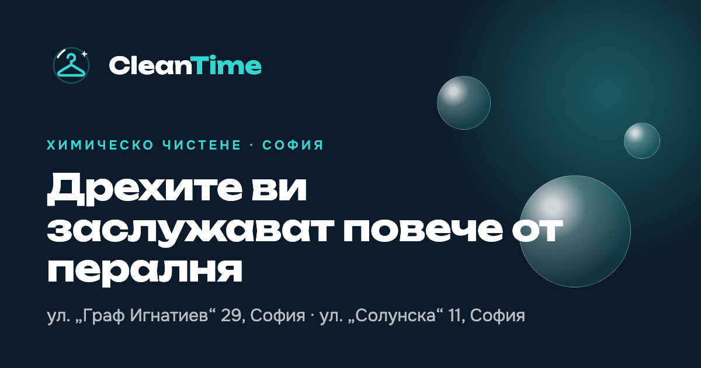

<p align="center">
  
</p>

<h1 align="center">CleanTime</h1>

<p align="center">
  Сайтът на CleanTime – химическо чистене и пране с две ателиета в центъра на София.<br>
  Три езика, 3D сцени, помощник в чат и всичко нужно за Google.
</p>

<p align="center">
  <a href="https://cleantime-six.vercel.app"><b>🌐 Виж сайта на живо → cleantime-six.vercel.app</b></a>
</p>

<p align="center">
  
  
  
  
  
</p>

---

## Какво има вътре

| | |
|---|---|
| 🌍 **Три езика** | Български, английски и немски, всеки на собствен адрес (`/bg`, `/en`, `/de`). |
| 🫧 **3D мехури** | Сапунени мехури в началото, които плуват, отдръпват се от мишката и се пръскат при докосване. |
| 🧥 **3D закачалка** | Хромирана закачалка в края на страницата, която се върти със скролването и при докосване. |
| 🃏 **Карти в дълбочина** | Услугите се накланят към мишката или под пръста, с отблясък. |
| 💬 **Помощник** | Чат с около 40 теми: услуги, петна, етикети, боядисване, ателиета. Разбира и трите езика. |
| 🏷️ **Етикетът на дрехата** | Какво значат знаците за професионално почистване. |
| ↔️ **Преди и след** | Плъзгач за сравнение на снимки. |
| 📍 **Двете ателиета** | Карта, телефон и упътване за всяко. |
| 📱 **Телефон на първо място** | Меню на цял екран, лента „Обади се“, ефекти при докосване. |
| 🔎 **За Google** | Данни за местен бизнес, въпроси и отговори, карта на сайта, картинки за споделяне. |

Без цени на сайта и без онлайн поръчка: така е решено с клиента. Главното действие навсякъде е обаждане.

## Стартиране

Трябва Node.js 20 или по-нов.

```bash
npm install
npm run dev
```

Сайтът тръгва на [http://localhost:3000](http://localhost:3000) и пренасочва към `/bg`.

| Команда | Какво прави |
|---|---|
| `npm run dev` | Пуска сайта за разработка. |
| `npm run build` | Строи готовата версия. |
| `npm run start` | Пуска построената версия. |
| `npm run lint` | Проверява кода. |

## Къде какво се намира

```
src/
├── app/
│   ├── [lang]/           страницата и общата рамка за всеки език
│   ├── globals.css       цветове, анимации, 3D накланяне
│   ├── sitemap.ts        карта на сайта
│   ├── robots.ts         правила за търсачките
│   └── manifest.ts       иконка и име за началния екран на телефон
├── components/
│   ├── three/            3D сцените: мехури, закачалка и общата им основа
│   ├── Scene3D.tsx       зарежда 3D сцена след първото изрисуване
│   ├── Assistant.tsx     чатът на помощника
│   ├── Tilt.tsx          карта, която се накланя в 3D
│   ├── BeforeAfter.tsx   плъзгачът „преди и след“
│   ├── MobileMenu.tsx    менюто за телефон
│   ├── Effects.tsx       лентата за напредък и появяването при скролване
│   └── Logo.tsx          логото
├── lib/
│   ├── site.ts           ателиетата, телефоните, адресът на сайта
│   ├── i18n.ts           списъкът с езици
│   └── assistant.ts      кои думи към кой отговор водят
└── messages/
    ├── bg.json           всички текстове на български
    ├── en.json           … на английски
    └── de.json           … на немски
```

## Как се променя нещо

**Текст.** Всичко, което се чете на сайта, е в `src/messages/`. Една промяна се прави и в трите файла, със същите ключове.

**Телефон или адрес.** В `src/lib/site.ts`, а изписването на адреса за всеки език е в `locations.items` на трите езикови файла.

**Нов отговор на помощника.** Текстът отива в `assistant.kb` на трите езикови файла, а думите, по които се разпознава въпросът, в `knowledge` в `src/lib/assistant.ts`. Помощникът не съчинява нищо: отговаря само с текст от тези файлове, а когато не знае, дава телефоните.

**Нов език.** Нов файл в `src/messages/`, добавен в `src/lib/i18n.ts`, плюс картинка за споделяне в `public/og/`.

**Снимки.** Сивите полета с надпис „Снимка – предстои“ са местата за истинските снимки от ателиетата.

## Качване

Сайтът се качва на ръка във Vercel:

```bash
vercel --prod
```

Две настройки управляват поведението в търсачките:

| Настройка | За какво е |
|---|---|
| `NEXT_PUBLIC_SITE_URL` | Истинският адрес на сайта, например `https://cleantime.bg`. Без нея се ползва адресът от Vercel. |
| `NEXT_PUBLIC_INDEXABLE` | Стойност `true` пуска сайта в Google. Без нея сайтът е скрит от търсачките. |

## Преди пускането на истинския домейн

- [ ] Истински снимки от двете ателиета и поне една двойка „преди и след“
- [ ] Работно време на двете ателиета
- [ ] Клиентът е прочел текстовете, особено немския и английския
- [ ] Домейнът е насочен към Vercel
- [ ] `NEXT_PUBLIC_SITE_URL` и `NEXT_PUBLIC_INDEXABLE=true` са зададени

## Правила, които пазят сайта бърз

- Нищо не започва невидимо при първото изрисуване. Появяването при скролване се включва чак след зареждането и само за това, което е под екрана.
- 3D сцените се зареждат след текста и бутоните и спират, когато не се виждат.
- На телефон мехурите са по-малко и по-леки.
- При изключени анимации в настройките на устройството 3D сцените и движенията не се пускат.

---

<p align="center">
  <b>Версия 1.0.0</b> · Николай Тодоров · <a href="https://wavsy.dev">Wavsy</a>
</p>
